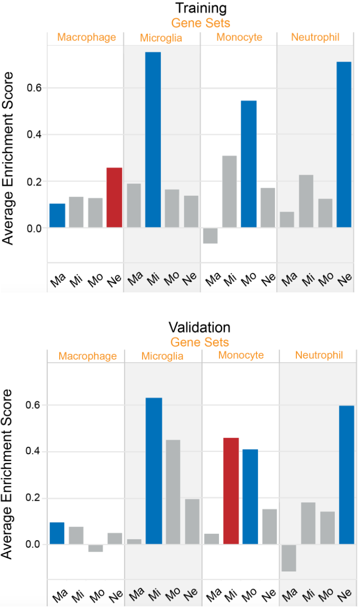

# Neuroimmunology Capstone

## Dependencies

### R

The process depends on a modern R (v3.3) and several R packages.

 * `readr` == `1.0.0`
 * `dplyr` == `0.5.0`
 * `argparse` == `1.0.4`
 * `purrr` == `0.2.2`
 * `stringr` == `1.2.0`
 * `lazyeval` == `0.2.0`


### Python

While requiring a python (v3.5) environment and the following python dependencies. (Also listed in `requirements.txt`)

 * `numpy` == `1.12.1`
 * `pandas` == `0.19.2`
 * `scipy` == `0.19.0`
 * `scikit-learn` == `0.18.1`

### Node

Install proper make dependencies with `npm install` with node (>6.0). Dependencies are listed in `package.json`.

## Operation

The project generates gene sets with a boostrapped LDA method.

The pipeline operates by:

1. Pre-process raw data (`load_data.R`)
2. Bootstrap the clean data (`score_lda.py`)
3. Build Gene Sets from Bootstraps (`pairwise_buildsets.py`)
4. Score Sets based on GSVA enrichment score (`score_gsva.R`)
5. Resolve final sets

The pipeline is controlled by `node make.js`. The javascript concurrency (number of logical processors to use in operations) can be configured in these function calls. Javascript uses promises to chain the operations. `runTask({})` is a promise that will run a full pass with the default hyperparameters. Pass an object to override the defaults.

```js
{
  bootstraps: 100,      // Number of bootstrap passes
  fraction: 0.66,       // Fraction of genes to sample per bootstrap
  scoring: 'fmeasure',  // metric for scoring gene pairs [accuracy, precision, recall, fmeasure]
  low: 25,              // Smallest allowable gene set count
  high: 200,            // Largest allowable gene set count
  count: 50,            // Maximum number of gene sets to create per cell type
  pairs: 500            // Number of gene pairs to generate from the bootstrap
}
```

## Results

The [final report](reports/Gene.Set.Creation.Algorithm.for.Microarray.Studies.with.Low.Sample.Size.pdf) details the results of the full pipeline and analysis of results. The [poster](reports/poster.pdf) is a single sheet that covers the project.

#### Enrichment Compared to Baseline

Enrichment score compared to a set generated without bootstraps.


#### Enrichment of Gene Sets by Samples

Average enrichment scores of each sample type compared to the gene sets for each cell type. Gene sets are in orange while averages samples are in black. Ideally, the gene set should only be enriched for the target cell type.




## Tests

Run tests with `make test` or `python -m unittest discover`.

## Docker

The [docker image](https://hub.docker.com/r/user01e/gscauva/) can be built with:

```bash
docker build -t localimage:0.1 .
```

Or run the public image with:

```bash
docker run --rm -it -v "$PWD":/home user01e/gscauva:1.0 bash
```

Or run the full set of pipelines with:

```bash
docker run --rm -it -v "$PWD":/home user01e/gscauva:1.0 bash -c "node make.js"
```
